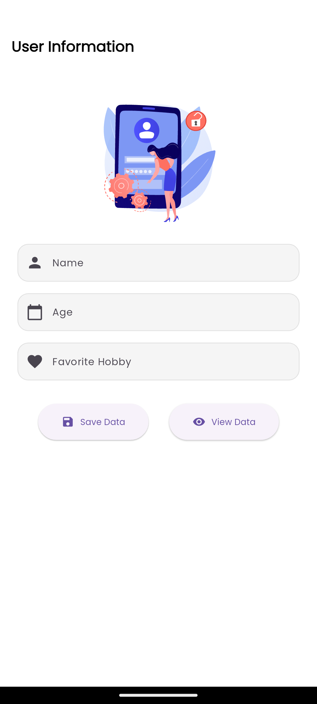
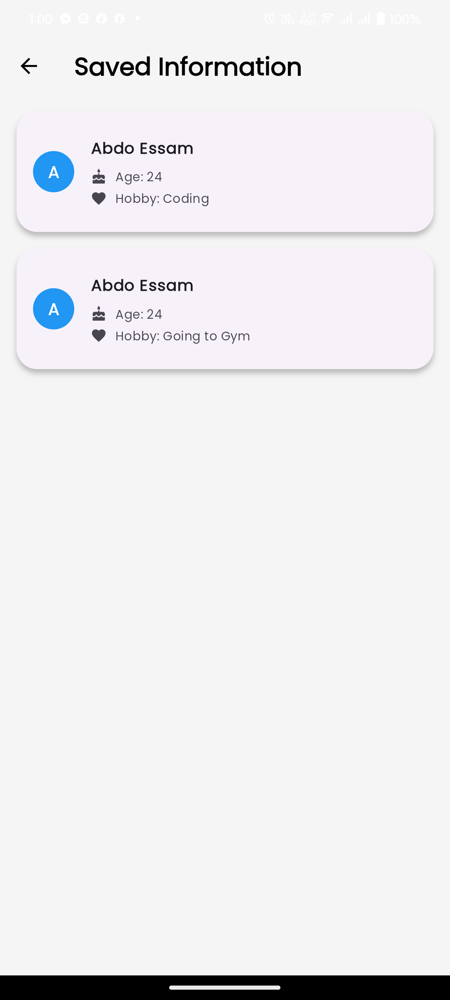

# User Information App 📱

A beautiful Flutter application that demonstrates Firebase Firestore integration for storing and displaying user information with an elegant, modern UI design.

## 🌟 Features

- Modern and intuitive user interface
- Animated components and smooth transitions
- Real-time data synchronization with Firebase
- Form validation and error handling
- Responsive design
- Loading states and user feedback
- Clean and organized code structure

## 🎨 UI Components

- Animated text headers using `animated_text_kit`
- Lottie animations for enhanced user experience
- Custom styled input fields
- Modern card designs
- Loading indicators
- Custom-styled snackbars
- Material Design icons
- Google Fonts integration

## 🛠️ Technical Features

- Firebase Firestore integration
- Real-time data updates using StreamBuilder
- Form validation
- Error handling
- Clean architecture
- Separate widget files
- Reusable components

## 📱 Screenshots

## Screenshots
| Home Screen                      | Saved Data Screen                |
|----------------------------------|----------------------------------|
|  |  |

## 🚀 Getting Started

### Prerequisites

- Flutter SDK
- Firebase account
- Android Studio / VS Code
- Git

### Installation

1. Clone the repository
```bash
git clone https://github.com/abdo-essam/user_info_app.git